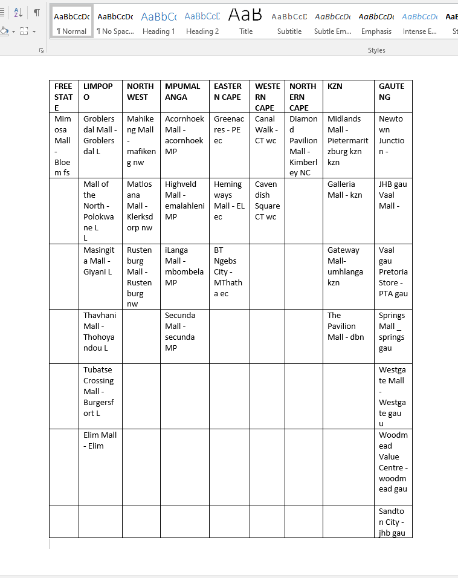

# Bathu Sales Analysis Project
## Overview
This project aims to analyze the sales data of Bathu, a popular South African footwear brand. The analysis focuses on understanding sales dynamics, identifying key performance drivers, and providing actionable insights to optimize sales and profitability.

## Data Modifications
Regional Adaptation: The original data has been modified to fit South African regions.

- Currency Conversion: All amounts have been converted to South African Rand (ZAR).
- Data Normalization: The data has been normalized to ensure consistency and accuracy in the analysis.
## Objectives
- Monthly Sales Distribution: Visualize the monthly distribution of total sales to identify peak periods.
- Geographical Sales Analysis: Represent total sales across different South African regions using a filled map.
- Regional Contribution: Use a donut chart to compare the contribution of different regions to total sales.
- Product Performance: Analyze the sales distribution among various Bathu products using a bar chart.
- Retailer Contribution: Visualize the contribution of different retailers to total sales using a bar chart.

## Tools and Technologies
-Power BI: For data visualization and analysis.

-Excel: For data cleaning and preprocessing.

## Getting Started
### Prerequisites
Excel
Power BI Desktop

### Usage
Data Preparation: Run the data preparation script to clean and normalize the data.

Visualization: Open the Power BI file (bathu_sales_analysis.pbix) to view the visualizations and insights.

Contributing Contributions are welcome! Please fork the repository and submit a pull request with your changes.

## Acknowledgements
Adidas for providing the sales data.
Power BI and Excel community for their valuable tools and resources.

